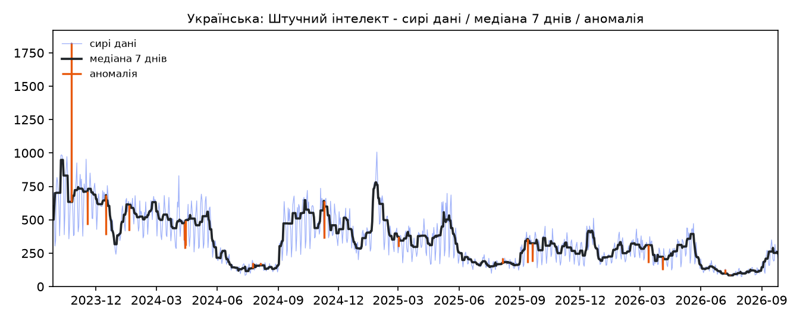
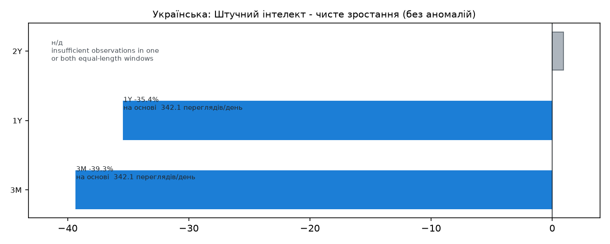
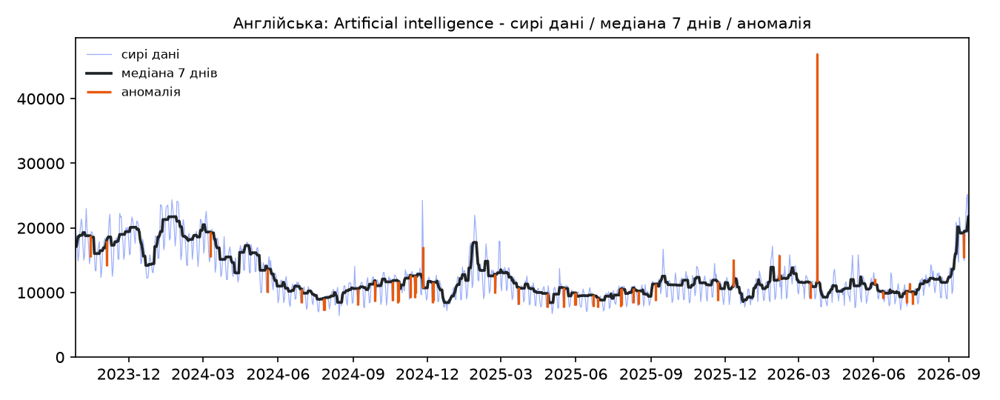
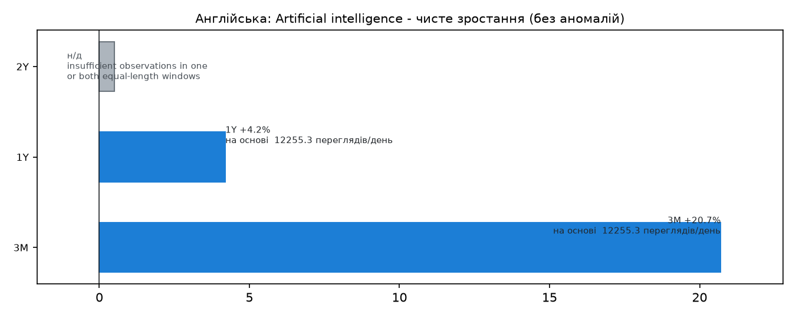
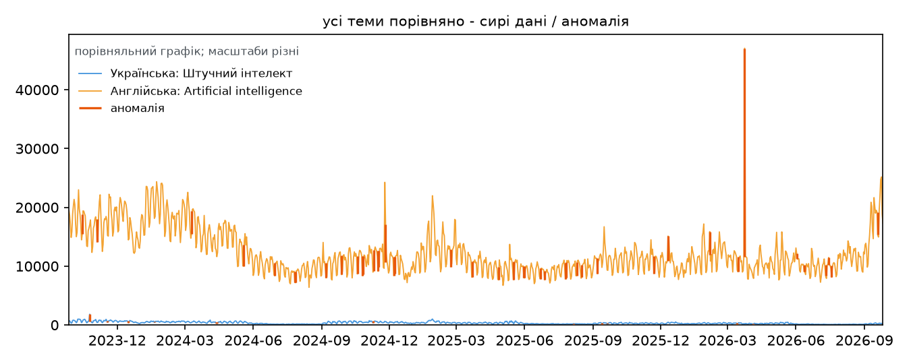

# Аналіз переглядів Wikipedia

## Висновок

- Українська: Штучний інтелект · 3M вікно: -39.3% · на основі 342.1 Переглядів/день
- Українська: Штучний інтелект · 1Y вікно: -35.4% · на основі 342.1 Переглядів/день
- Українська: Штучний інтелект · 2Y вікно: н/д (недостатньо спостережень в одному або в обох однакових за довжиною вікнах) · на основі 342.1 Переглядів/день
- Англійська: Artificial intelligence · 3M вікно: +20.7% · на основі 12,255.3 Переглядів/день
- Англійська: Artificial intelligence · 1Y вікно: +4.2% · на основі 12,255.3 Переглядів/день
- Англійська: Artificial intelligence · 2Y вікно: н/д (недостатньо спостережень в одному або в обох однакових за довжиною вікнах) · на основі 12,255.3 Переглядів/день

## Метрики

Дані станом на 2026-09-26

| Тема | Проєкт | Стаття | Мова | Період | Усього переглядів | Переглядів/день | Зростання | Напрям | Впевненість | Частка аномалій |
|---|---|---|---|---|---|---|---|---|---|---|
| Українська: Штучний інтелект | uk.wikipedia | %D0%A8%D1%82%D1%83%D1%87%D0%BD%D0%B8%D0%B9_%D1%96%D0%BD%D1%82%D0%B5%D0%BB%D0%B5%D0%BA%D1%82 | uk | 2023-09-27..2026-09-26 (1,096) | 374,909 | 342.1 | 3M -39.3% / 1Y -35.4% / 2Y н/д (недостатньо спостережень в одному або в обох однакових за довжиною вікнах) | спад | висока | 0.016423357664233577 |
| Англійська: Artificial intelligence | en.wikipedia | Artificial_intelligence | en | 2023-09-27..2026-09-26 (1,096) | 13,431,833 | 12,255.3 | 3M +20.7% / 1Y +4.2% / 2Y н/д (недостатньо спостережень в одному або в обох однакових за довжиною вікнах) | плоске | висока | 0.03832116788321168 |

## Наскільки можна довіряти

- Українська: Штучний інтелект: висока — період щонайменше 730 днів; переглядів за 30 днів щонайменше 10000; частка аномалій у межах 5 відсотків
- Англійська: Artificial intelligence: висока — період щонайменше 730 днів; переглядів за 30 днів щонайменше 10000; частка аномалій у межах 5 відсотків

## Графіки

порівняльний графік; масштаби різні

## Обмеження та припущення

- припущення автора: у uk.wikipedia спільного англомовного запиту "artificial intelligence" виявилося недостатньо: discovery повернув 5 придатних кандидатів, і жоден з них не був статтею про тему (Machine Intelligence Research Institute, Штучний інтелект: сучасний підхід, Європейська конференція з питань штучного інтелекту, Асоціація з розвитку штучного інтелекту, Міжнародна об'єднана конференція зі штучного інтелекту) — усі з 19–39 переглядами за 30 днів. Після перезапуску discovery з --topic-for uk.wikipedia="штучний інтелект" головна стаття знайдена: 6 185 переглядів за 30 днів
- припущення автора: обидва проєкти мали статус ambiguous (по 5 придатних кандидатів кожен), тому офлайн-підтвердження супроводжувалося --reason. Вибір зроблено за exact_title_match=true, який є єдиним критерієм, що дозволяє отримати recommendation, коли кандидатів більше одного
- припущення автора: це порівняння ДВОХ ОКРЕМИХ СТАТТЕЙ, а не двох мовних розділів. uk.wikipedia/Штучний інтелект (6 185 переглядів за 30 днів) та en.wikipedia/Artificial intelligence (488 242 за 30 днів) — статті різного обсягу в енциклопедіях різного розміру. Співвідношення обсягів НЕ є мірою переваги мови: воно включає довжину статті, кількість підтем, редакційну історію та розмір самої енциклопедії
- припущення автора: обидві серії вимірюють інтерес до ОДНІЄЇ статті, а не до теми в мовному розділі загалом. Перегляди однієї сторінки — вузька міра уваги: вона не включає внутрішні переходи, пошук у розділі та суміжні статті теми
- припущення автора: вікно 1095 днів коротше за 1460, потрібних для y2 (730 днів поточного вікна плюс 730 днів базового), тому зростання за 2 роки буде н/д — це правильна поведінка, а не збій. Сезонність рахується за двома вирівняними 365-дневними напівперіодами і доступна
- Українська: Штучний інтелект: повторюваних пікових місяців не виявлено
- Англійська: Artificial intelligence: повторюваних пікових місяців не виявлено
- Українська: Штучний інтелект [chart_uk-shtuchnyi-intelekt_timeseries.png] — прогалин: 0; намальованих аномалій: 18; знецінених точок: 0
- Українська: Штучний інтелект [chart_uk-shtuchnyi-intelekt_growth.png] — прогалин: 0; намальованих аномалій: 0; знецінених точок: 0
- Англійська: Artificial intelligence [chart_en-artificial-intelligence_timeseries.png] — прогалин: 0; намальованих аномалій: 42; знецінених точок: 0
- Англійська: Artificial intelligence [chart_en-artificial-intelligence_growth.png] — прогалин: 0; намальованих аномалій: 0; знецінених точок: 0
- усі теми порівняно [chart_overlay.png] — прогалин: 0; намальованих аномалій: 60; знецінених точок: 0

## Наступний крок

Це не прогноз і не рекомендація.

---

Джерело: artificial_intelligence_uk_en · Дані станом на 2026-09-26 · Виміряно · Це не прогноз і не рекомендація
